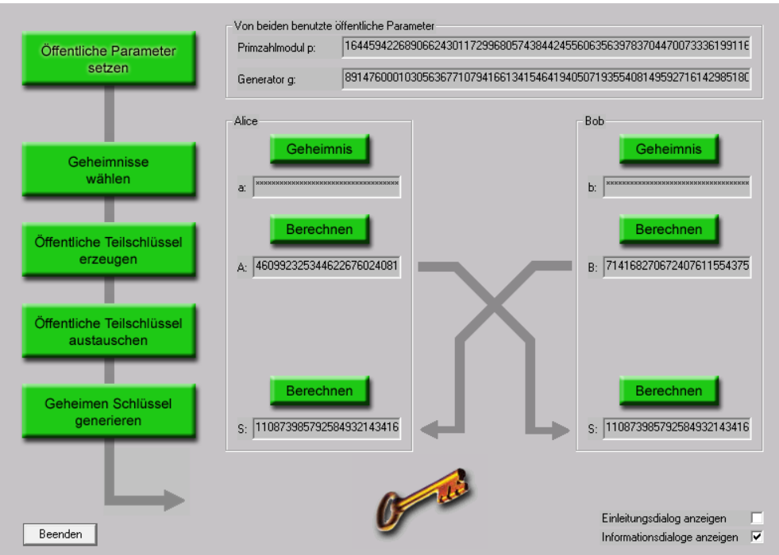

## Aufgaben zur asymmetrischen Verschlüsselung

1. Spielen sie in Cryptool1 einen Schlüsseltausch gemäss Diffie-Hellman durch. Experimentieren sie mit verschiedenen, auch eigenen Parametern. (Sie finden das Tool unter Einzelverfahren→Protokolle→Diffie-Hellman-Demo...)
	
1. RSA-Verschlüsselung: Erzeugen sie zwei asymmetrische Schlüsselpaare: Eines für «Muster Felix» und eines für «Hasler Harry» (Sie finden das Tool unter Digitale Signaturen/PKI→PKI→Schlüssel erzeugen/importieren...)  Verschlüsseln Sie nun eine Nachricht für Muster Felix und versuchen sie danach, den Text als Hasler Harry, danach als Muster Felix zu entschlüsseln. Was stellen sie fest? (Sie finden die Tools unter Ver-/Entschlüsseln→Asymmetrisch→RSA-Ver/Entschlüsselung...)
2. Im Gegensatz zum Diffie-Hellman-Verfahren (für Schlüsseltausch) kann RSA einen kompletten Text verschlüsseln. Sehen sie sich dazu die RSA-Demo an. (Sie finden das Tool unter Ver-/Entschlüsseln→Asymmetrisch→RSA-Demo...)
3. Moderne Verschlüsselungsverfahren arbeiten hybrid. Schauen sie sich dazu die beiden Demos zu RSA-AES an. (Sie finden die Tools unter Ver-/Entschlüsseln→Hybrid→RSA-AES-Ver/Entschlüsselung...)
4. (Optionale Aufgabe für Mathe-Fans) Wir verwenden hier nochmals die RSA-Demo. (Sie finden das Tool unter Ver-/Entschlüsseln→Asymmetrisch→RSA-Demo...) Wir möchten der Sicherheit etwas auf den Zahn fühlen: Um den geheimen und öffentlichen Schlüssel zu erstellen, müssen zuerst zwei Primzahlen gewählt werden. Unter Primzahlen generieren kann bei Primzahl p bzw. q eine Primzahlunter- und obergrenze bestimmt werden, in dessen Bereich Primzahlen generiert werden. Öffentlich ist dann das RSA-Modul N und der öffentliche Schlüssel e. Wir möchten nun prüfen, wie gross die beiden Primzahlen p und q gewählt werden müssen, damit die Faktorisierung des RSA-Moduls N und damit das Knacken des geheimen Schlüssels d nicht so mühelos gelingen kann. Das RSA-Modul N kann mit folgendem Tool faktorisiert werden: Analyse→Asymmetrische Verfahren→Faktorisieren einer Zahl... Erstellen sie nun mit RSA-Demo bei kleinen, max. 2-stelligen Primzahlen das RSA-Modul N und lassen sie danach die Zahl im anderen Tool faktorisieren. Sie werden feststellen, dass die Faktorisierung in wenigen Augenblicken erledigt ist und somit der Geheimtext entschlüsselt werden könnte. Wiederholen sie nun den Versuch mit grossen Primzahlen. Sie können dazu im Menü «Primzahlen generieren» die Primzahlobergrenze p und q auf zum Beispiel 128 Bit (2^128) erhöhen. Versuchen sie nun das erhaltene RSA-Modul N mit dem Analyse-Tool zu faktorisieren. Sei werden sehen, dass dies nun nicht mehr so ohne weiteres (Zeitaufwand) gelingen wird.