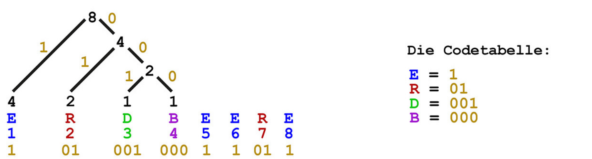
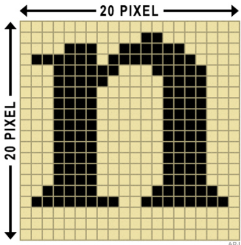

# Komprimierung
## Huffman-Algorithmus

Der Huffman-Algorithmus ist ein verlustfreier Kompressionsalgorithmus, der die Häufigkeit von Zeichen in einer Nachricht nutzt. Er erstellt einen binären Codebaum, wobei häufige Zeichen kurze Codes erhalten, um die Gesamtlänge der codierten Nachricht zu minimieren. Bei der Dekodierung wird der Codebaum verwendet, um die ursprüngliche Nachricht wiederherzustellen.

## RLC (Run Length Coding) bzw. RLE (Run Length Encoding)

Run Length Coding (RLC) oder Run Length Encoding (RLE) ist ein einfacher verlustfreier Kompressionsalgorithmus, der auf dem Prinzip der Wiederholung von aufeinanderfolgenden Daten basiert. Er ersetzt eine Sequenz von wiederholten Daten durch eine einzelne Instanz des Datenwerts und die Anzahl der Wiederholungen. Dadurch wird die Größe der Daten reduziert, insbesondere wenn große Mengen an wiederholten Daten vorliegen. Bei der Dekodierung wird die ursprüngliche Sequenz durch die wiederholten Daten wiederhergestellt.

## Aufgaben

### RL-Code entziffern
**Sie erhalten diesen RL-Code:**  
010100011110010010010010010010010010010110010110010010010010010010010010001  
Folgendes ist ihnen dazu bekannt: Es handelt sich um eine quadratische Schwarz-Weiss-Rastergrafik mit einer Kantenlänge von 8 Pixel. Es wird links oben mit der Farbe Weiss begonnen. Eine Farbe kann sich nicht mehr als siebenmal wiederholen. Zeichnen sie die Grafik auf. Was stellt sie da?

- 8 Pixel * 8 Pixel
- Beginnt Links oben mit Weiss
- Grösste Wiederholung = 7 mal = 3 Bits
- 75 Bits

75 / 3 = 25 Farbwechsel

#### Visualisiert
	010 100 011 110 010 010 010 010 010 010 010 010 010 110 010 110 010 010 010 010 010 010 010 010 001

#### Encoded
	010 2 / 100 4 / 011 3 / 110 6 / 010 2 / 010 2 / 010 2 / 010 2 /010 2 / 010 2 / 010 2 / 010 2 / 010 2 / 110 6 / 010 2 / 110 6 / 010 2 / 010 2 / 010 2 / 010 2 / 010 2 / 010 2 / 010 2 / 010 2 / 001 1

#### Lösung:
Das ergebnis Zeigt ein A

